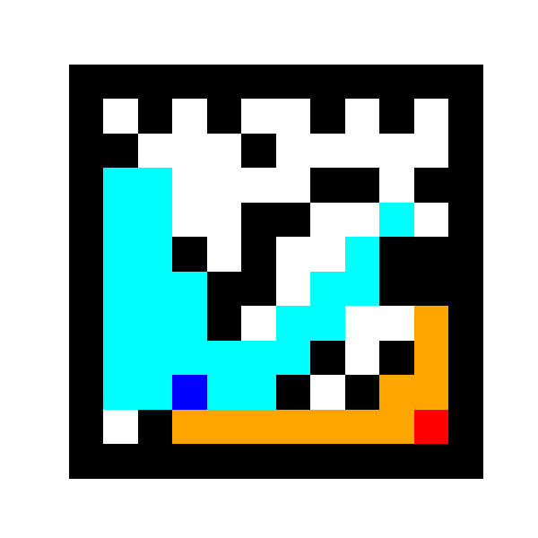
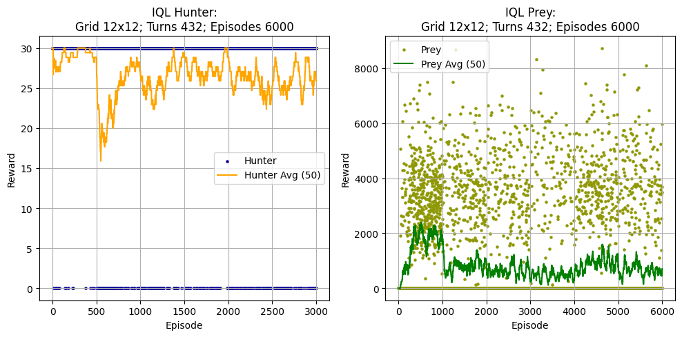

# Hunter Prey DQN
*Hunter Prey DQN* is a work-in-progress project working on RNN DQN model aiming to create a Reinforcement Learning model for training of two agents that would able to play a game of Catch without any supervision from a human.
## Goals
- [x] Two instances of agent
- [x] Randomly generated playground
- [x] Working circular vision for the players
- [x] Vision collision with walls of the playground
- [x] Render steps in console
- [x] Save replay as a GIF
- [ ] Save state function
- [ ] Load and play state function
## Future goals
- [ ] UI-based implementation
- [ ] Animated output
- [ ] Educational information
## Files structure

| File name                                | Content description                                                   |
| ---------------------------------------- | --------------------------------------------------------------------- |
| [HnP_Bresenham.py](HnP_Bresenham.py)     | Bresenham supercover algorithm                                        |
| [HnP_Enviroment.py](HnP_Enviroment.py)   | Playground settings, ruleset; Step ruleset; Render and save animation |
| [HnP_Pathfinding.py](HnP_Pathfinding.py) | Pathfinding logics for weights finetune                               |
| [HnP_Player.py](HnP_Player.py)           | Movement settings, local view and vision implementation               |
| [HnP_Train.py](HnP_Train.py)             | Contains training settings as well as plot output of the final graph  |
| [HnP_RNN.py](HnP_RNN.py)                 | RNN implementation of the network, base agent class and buffer        |
The files structure is upon changing
## Model settings
Go to the [HnP_Train.py](HnP_Train.py). In the top-level environment `__main__` you will be able to initialise number of episodes for players `episodes_hunter`/`episodes_prey`, number of episodes per turn `episode`, number of turns `tries`, `batch_size` or if you want to save the animations `render_on`.
## Agent settings
In [HnP_RNN.py](HnP_RNN.py) in `__init__` arguments of `RNNAgent` class you can change RNN model parameters such as gamma, epsilon, etc.
## Visualisation settings
[HnP_Enviroment.py](HnP_Enviroment.py)'s `render` contains attribute `return_frame` that is set to *False* by default. Switch it to *True* to render each step in the console.

For the GIF settings use the beforementioned `render_on` attribute of the top-level environment `__main__` in [HnP_Train.py](HnP_Train.py) to turn the GIF generation on and off.

Additionally, in the [HnP_Enviromen.py](HnP_Enviroment.py) `save_animation`'s attributes you are able to set the desired FPS for the final render.

The process of GIF production and export is done over [matplotlib](https://matplotlib.org/stable/api/animation_api.html) animation library.
Turning on the console render or GIF export may significantly increase the runtime.

By default Hunter is set to red and its FOV is set to orange, Prey to blue and its FOV is set to light blue, walls to black and free space to white.

The last frame stays on for 3 seconds by default.

Example of the GIF output:

Example of Graph output:

## Basics of the model and the reward system
This is an [LSTM](https://arxiv.org/pdf/1909.09586)-based [RNN](https://cs229.stanford.edu/proj2016/report/ChenYingLaird-DeepQLearningWithRecurrentNeuralNetwords-report.pdf) model featuring one base agent and deriving two training models from that: the Hunter and the Prey.

Hunter's goal is to catch Prey, meaning be on the same cell as the Prey.

For navigation the players use a set consisting of:
	**x-y coordinates** of the player, **x-y coordinates** of the other player (default (-1, -1) if not in vision), the list of **possible moves** (walls around may constrain the set of \[UP, DOWN, LEFT, RIGHT and STAY]), **indicator for if Hunter sees Prey** and vice-versa, and  the **direction vector** to the other player (default (-1, -1) if not in vision). This equals to 8 base states.
	Additionally the model receives a matrix of 25 elements (r\*r, the FOV radius) indicating if the player sees the cell or not (calculated with [Bresenham](https://dedu.fr/projects/bresenham/) algorithm).
	
The first turn of the model, Hunter is learning to catch a random-moving Prey.

Hunter gets rewarded for standing in position with largest FOV, and can accumulate this reward to up to 30 per episode. If it does not catch the Prey, the reward goes to zero. If it catches Prey at any point, the reward sets to the maximum value of 30.

After the initial turn, the models switch. At this point, Hunter is being controlled by the latest model from the previous turn, and Prey learns from it now.

Prey gets rewarded for standing in the most closed positions, which yield 5 points at most, if Prey completely covered by walls, and 0 if it stands in the open. If Hunter does not catch the Prey, the reward goes to the maximum 30. If Hunter catches Prey at any point, the reward sets to zero.

Then the process repeats, now with the latest trained models as many times as set in the `tries` of `__main__` of [HnP_Train.py](HnP_Train.py).

## Basics of the environment
In this project the [Cellular Automata Method](https://www.roguebasin.com/index.php?title=Cellular_Automata_Method_for_Generating_Random_Cave-Like_Levels) is used for generating a field. It can be found under `generate_field` in [HnP_Enviroment.py](HnP_Enviroment.py). Adjust `p_set` to whatever percentage of free cells on the field is required.

After the initial field generation, players will be spawned in random free cells. An [A\*](https://theory.stanford.edu/~amitp/GameProgramming/AStarComparison.html) algorithm will be used to determine if there is a free passage between these two points. If there is none, or if the spawn points overlap, the field will be regenerated and the spawn process will be repeated. the cycle repeats until a suited playground found.

The vision set of points is being calculated with the [Bresenham-based supercover line algorithm](https://dedu.fr/projects/bresenham/). This is an improved version of [Bresenham algorithm](https://csustan.csustan.edu/~tom/Lecture-Notes/Graphics/Bresenham-Line.pdf) that fixed the common issue of rays going through diagonally placSed walls. Please, read more in the source article. The settings for this algorithm shall not be altered. The generalised Python code of this algorithm can be found in [HnP_Bresenham.py](HnP_Bresenham.py).
## Authors
[Grigorii Kobzarenko (Owner)](https://github.com/GrzegorzHimself)
[Kulikov Oleg](https://github.com/OlegKulikov09)
[Elgawish Ahmed](https://github.com/ANElGawish)